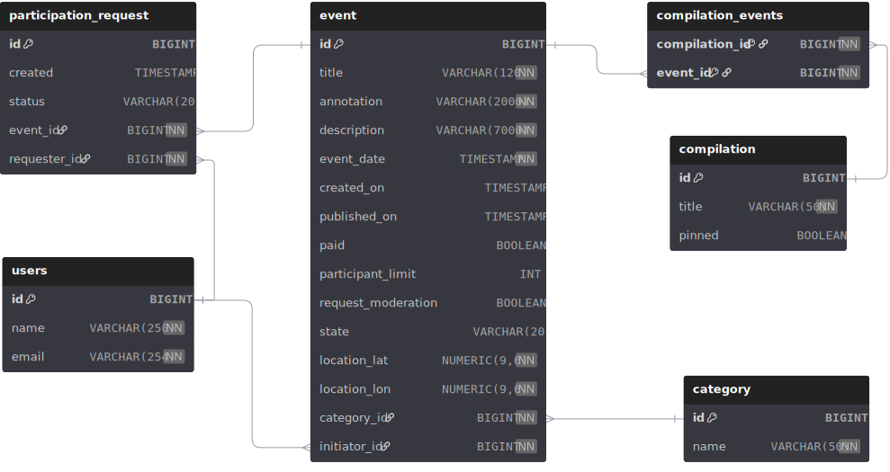
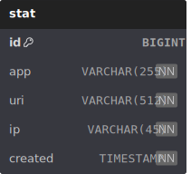

# Explore with me

Repository for explore with me app - social network for sharing interesting events with users and find
companies to participate in them. Written in java.

# Contributors

[LightInTheFire](https://github.com/LightInTheFire) 
[Basarus](https://github.com/Basarus) 
[Kreidl](https://github.com/Kreidl) 

# Main service db schema

  

# Stats service db schema

  

